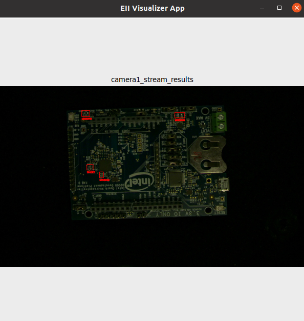

# EII安装指南 (Ubuntu 20.04, EII 3.0, Github)

EII全称Open Edge Insights for Industrial，开源工业边缘洞见平台。该平台由Intel公司开发，目前已在Github开源。EII通常部署在工业边缘节点，用于视频数据/时序数据的采集，分析和可视化。EII采用Docker容器化的部署方式，具有很好的灵活性和可扩展性。EII采用源码发布的方式，用户可以下载EII源代码进行二次开发。

目前有2种方式获取EII。1) 通过Github下载EII源码，2) 通过EII官方网站下载EII源码包。
- EII官方网站：https://intel.com/edge-insights-industrial
- EII官方Github仓库：https://github.com/open-edge-insights
- EII官方Docker Hub仓库：https://hub.docker.com/u/openedgeinsights

本文以Github下载EII源码的方式，介绍在Ubuntu 20.04系统上安装EII 3.0的方法。

## 预先步骤

* 在设备上安装Ubuntu 20.04 LTS。

* 将设备连接互联网。

* (可选) 将apt源设置为国内源(如清华源)，可加速apt依赖包的下载。

    - 设置方法：点击Ubuntu桌面左下角"九个点" -> 打开"Software & Updates"应用程序 -> 在"Ubuntu Software"标签栏下的"Download from"选项，选择"Other..." : "China" : "mirrors.tuna.tsinghua.edu.cn" -> 点击"Choose Server" -> 点击"Close" -> 在弹出的对话框中点击"Reload" -> 等待"Cache Refresh"结束(若Cache Refresh失败可忽略)。

    - 打开命令行，执行如下命令更新apt源。
    ```
    $ sudo apt update
    ```

* (可选) 将pip源设置为国内源(如清华源)，可加速python依赖包的下载。

    - 新建"pip.conf"文件
    ```
    $ mkdir -p ~/.pip
    $ gedit ~/.pip/pip.conf
    ```

    - 在"pip.conf"文件中添加如下内容：
    ```
    [global]
        index-url=https://pypi.tuna.tsinghua.edu.cn/simple/
    [install]
        trusted-host=pypi.tuna.tsinghua.edu.cn
    ```

    - 更新pip工具。
    ```
    sudo -E pip3 install --upgrade pip
    ```

## 下载EII源码

### 安装预备工具

* 安装预备工具。
```
$ sudo apt update && sudo apt install -y curl git
```

* 配置git参数。
```
# Set email and name
$ git config --global user.email [Your Email]
$ git config --global user.name [Your Name]

# Disable CA verify
git config --global http.sslverify false
```

* 配置python软链接(后续使用的"repo"工具需要这项配置)。
```
$ sudo ln -s /usr/bin/python3 /usr/bin/python
```

* 安装repo工具。
```
curl https://storage.googleapis.com/git-repo-downloads/repo > repo
sudo mv repo /bin/repo
sudo chmod a+x /bin/repo
```

* 执行如下命令，若成功打印repo的版本信息，则说明repo安装成功。
```
$ repo --version
```

* (可选)设置repo url，国内网络可能无法访问repo某些位于国外的源，可通过如下命令，将repo url修改为国内的源。
```
$ export REPO_URL="https://gerrit-googlesource.lug.ustc.edu.cn/git-repo"
```

### 拉取EII源码

* 新建一个工作目录(例如"~/eii")，并进入。
```
$ mkdir -p ~/eii
$ cd ~/eii
```

* 拉取EII仓库清单(以v3.0版本为例)。清单文件保存在目录".repo/manifests"下。
```
repo init -u "https://github.com/open-edge-insights/eii-manifests.git" -b refs/tags/v3.0
```
> 若需要拉取EII其他版本，修改"-b"参考后的tag标签即可。

* 修改".repo/manifests/default.xml"文件，将Github地址修改为Gitee。repo工具在国内网络环境下拉取Github代码时会超时，故将代码库从Github修改为Gitee (EII在Gitee有一个与Github保持同步的镜像仓库)。

    用编辑器(如gedit)打开".repo/manifests/default.xml"文件
    ```
    $ gedit .repo/manifests/default.xml
    ```

    参考如下内容进行修改：
    ```
    # 将"default.xml"的第3，4行
    <remote name="origin" fetch="https://github.com/open-edge-insights" />
    <remote name="github-origin" fetch="https://github.com/intel" />

    # 修改为如下内容
    <remote name="origin" fetch="https://gitee.com/open-edge-insights" />
    <remote name="github-origin" fetch="https://gitee.com/mirrors_intel" />
    ```

* 拉取EII源码。
```
$ repo sync
```

* 拉取成功后，EII源码即保存在目录"~/eii/IEdgeInsights中。

## 安装EII运行环境

* 安装docker和docker-compose

通过如下命令，安装和设置docker，docker-compose
```
# 创建一个目录用来存放安装包，并进入
$ mkdir -p ~/docker-install && cd ~/docker-install

# 下载安装包
$ wget https://gitee.com/open-edge-insights/eii-install-guide/attach_files/873577/download/docker-ce_20.10.9_3-0_ubuntu-focal_amd64.deb
$ wget https://gitee.com/open-edge-insights/eii-install-guide/attach_files/873579/download/docker-ce-cli_20.10.9_3-0_ubuntu-focal_amd64.deb
$ wget https://gitee.com/open-edge-insights/eii-install-guide/attach_files/873578/download/containerd.io_1.4.11-1_amd64.deb
$ wget https://gitee.com/open-edge-insights/eii-install-guide/attach_files/873576/download/docker-compose-Linux-x86_64-v1.29.0

# 安装docker
$ sudo dpkg -i docker-ce_*.deb docker-ce-cli_*.deb containerd.io_*.deb

# 安装docker-compose
$ sudo cp docker-compose-Linux-x86_64-v1.29.0 /usr/local/bin/docker-compose
$ sudo chmod +x /usr/local/bin/docker-compose
$ sudo ln -sf /usr/local/bin/docker-compose /usr/bin/docker-compose

# 将当前用户添加到"docker"用户组，使得当前用户不加"sudo"也可以使用docker命令
$ sudo groupadd docker
$ sudo usermod -aG docker $USER
$ newgrp docker
```

* 安装EII其他依赖，安装脚本位于"IEdgeInsights/build/pre_requisites.sh"。

    如果是国内网络环境下安装，需要对"pre_requisites.sh"脚本做一些修改。该脚本会通过尝试连接google官方来测试网络是否畅通，这个步骤在国内网络环境会失败，导致脚本退出，估将google修改为baidu。

    用编辑器(如gedit)打开"IEdgeInsights/build/pre_requisites.sh"文件
    ```
    $ gedit IEdgeInsights/build/pre_requisites.sh
    ```

    参考如下内容进行修改：
    ```
    # 将"pre_requisites.sh"的第161行
    wget http://www.google.com > /dev/null 2>&1

    # 修改为如下内容
    wget http://www.baidu.com > /dev/null 2>&1
    ```

    * 执行脚本。
    ```
    $ cd IEdgeInsights/build
    $ sudo ./pre_requisites.sh
    ```

* 修改EII配置文件"IEdgeInsights/build/.env".

```
# 开发阶段建议将dev_mode设置为true
DEV_MODE=true

# 设置相关服务模块的用户名和密码 (这里只是举例，具体的用户名和密码用户可自行调整)
# Service credentials
# These are required to be updated in both DEV mode & PROD mode
ETCDROOT_PASSWORD=admin@123
INFLUXDB_USERNAME=admin
INFLUXDB_PASSWORD=admin@123
MINIO_ACCESS_KEY=admin@123
MINIO_SECRET_KEY=admin@123
```

* 重启机器使得docker相关的配置生效。
```
$ sudo reboot
```

## 运行PCBA案例

* 打开命令行，执行编译脚本。
```
$ cd IEdgeInsights/build
$ sudo -E python3 builder.py -f usecases/video-streaming.yml
```

* 打开图形界面访问权限
```
$ xhost +
```

* 启动EII服务。(第一次启动会连接docker hub下载相关模块的docker images，耐心等待)
```
$ ./eii_start.sh
```

* 启动成功后，PCBA检测案例运行窗口如图。


* 关闭EII服务。
```
$ docker-compose down
```
