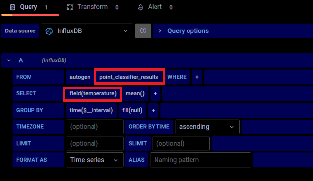

# EII时序栈部署指南(温度监控案例)

部署环境
- OS: Ubuntu 20.04 LTS
- EII Version: EII 3.0

EII时序栈(Time Series Stack)主要由4个模块组成：Telegraf，InfluxDB，Kapacitor和Grafana。
- Telegraf负责时序数据的采集。Telegraf采用插件的形式，支持多种工业现场总线，多种消息通讯协议。
- InfluxDB负责时序数据的存储。InfluxDB是一个流行的开源时序数据库，其在DB-Engine时序数据库排行榜排名第一。
- Kapacitor负责时序数据的分析和处理。Kapacitor和Telegraf, InfluxDB都是由"InfluxData"公司开发并开源，支持流式处理和批处理，能够和Telegraf，InfluxDB无缝对接。
- Grafana负责时序数据的可视化。Grafana是一个开源的基于Web的可视化框架，用户可以灵活地定制个性化的展示界面，同时它默认集成了InfluxDB输入源。

本文基于EII 3.0，介绍在EII中部署时序栈的步骤。

## 预先步骤

* 参考《EII安装指南》，安装EII 3.0。

## 运行温度监控案例

温度监控案例：本案例通过python测试脚本以MQTT协议发送10-30之间的模拟温度数据，Telegraf模块采用MQTT的input插件收集数据，并以InfluxDB的output插件将数据存入InfluxDB数据库。Kapacitor模块以流式处理的方式，对存入InfluxDB数据库的数据实时地分析过滤，将处于20-25之间的温度值过滤掉，过滤后的数据再存回InfluxDB数据库。Grafana模块在该案例中，用于数据的可视化展示。

### 启动服务

* 查看"IEdgeInsights/build/usecases/time-series.yml"配置文件，该文件包含了当前案例中包含的所有服务模块。本案例中暂不演示数据的输出功能，故将OpcuaExport和RestDataExport模块注释掉，即可将输入模块不包含进来。
```
AppContexts:
- ConfigMgrAgent
- EtcdUI
- Telegraf
- InfluxDBConnector
- Kapacitor
- Grafana
# - OpcuaExport
# - RestDataExport
- tools/mqtt/broker
- tools/mqtt/publisher
```

* 打开命令行，基于上述配置文件，执行编译脚本。
```
$ cd IEdgeInsights/build
$ sudo -E python3 builder.py -f usecases/time-series.yml
```

* 上述编译过程，会在当前目录("IEdgeInsights/build/")生成一系列文件，可以重点关注如下几个文件：

    - "docker-compose.yml": 该文件包含了所有服务的docker-compose信息，它是通过"builder.py"脚本将各个服务模块自身的docker-compose.yml文件汇聚起来，生成了一个总的docker-compose.yml文件。后续启动EII服务时，会基于该文件去启动服务。

    - "docker-compose-build.yml"：该文件用build服务模块的docker镜像文件。EII的部分服务模块已经上传到Docker Hub仓库，用户可以使用"docker pull"命令直接下载，Docker Hub仓库没有的镜像，可以通过该文件在本地build。

    - "eii_config.json"：该文件是所有服务模块的配置文件，在启动EII服务过程中，会自动加载到ETCD数据库中。

* 通过如下脚本"pull_images.sh"将所需的docker镜像从Docker Hub仓库拉取到本地，省去在本地build的时间。

*pull_images.sh*
```
pre_name=openedgeinsights
eii_version=3.0

image_list=(
ia_configmgr_agent
ia_etcd_ui
ia_telegraf
ia_influxdbconnector
ia_kapacitor
ia_grafana
)

for iname in ${image_list[*]}; do
    echo " "
    echo "pulling $iname"
    docker pull $pre_name/$iname:$eii_version
    echo "pull $iname done"
    echo " "
done
```

* 编译Docker Hub中没有包含的docker镜像。
```
$ docker-compose -f docker-compose-build.yml build ia_mqtt_publisher
```

* 启动EII服务。
```
$ ./eii_start.sh
```

* 启动成功后，命令行窗口会打印如下成功信息。
```
==================================================
Config Manager Agent has successfully initialized!
Bringing up the eii containers...
==================================================
ia_configmgr_agent is up-to-date
Creating ia_mqtt_publisher    ... done
Creating ia_telegraf          ... done
Creating ia_kapacitor         ... done
Creating ia_influxdbconnector ... done
Creating ia_etcd_ui           ... done
Creating ia_mqtt_broker       ... done
Creating ia_grafana           ... done
```

### 操作Grafana可视化工具

* 打开浏览器，输入地址"localhost:3000"，进入Grafana登录界面。


* 输入默认账号"admin"，密码"admin"，登录到主界面。


* 点击默认的"EII Video and Time Series Dashboard"，在Time Series的图表里可看到温度数据成功打印。该图表展示的即是过滤后的温度数据。


* 接下来，我们通过一个新的Dashboard来进行过滤前和过滤后数据的对比。创建一个新的Dashboard, 点击"Create" -> "Dashboard" -> "Add an empty panel".


* 进入到Panel设置界面，在左下角数据源窗口，选择"point_data"的"temperature"字段，这是没有过滤的温度数值。


* 右上角可以选择显示的时段范围，以显示最近5分钟的数据为例。


* 配置结束后，点击右上角"Apply"按钮，此时就配置好了Dashboard中的一个表，该表展示的是没有过滤的温度数值。


* 点击右上角的"Add panel"按钮再创建一个表。


* 将要在新表里显示过滤后的温度数据，故数据源窗口选择"point_classifier_results"的"temperature"字段。



* 点击"Apply"按钮。此时Dashboard里可以看到2张表。


* 点击右上角的"Refresh Dashboard"按钮，可以让表实时刷新。


* 通过两张表显示的数据对比可以看出，过滤算法成功将位于20-25之间的数据过滤掉了。


* 测试结束后，通过如下命令关闭EII的时序栈服务。
```
$ cd IEdgeInsights/build
$ docker-compose down
```

## 原理解析

* Telegraf模块用于采集数据，并将数据存入InfluxDB。Telegraf的配置文件"Telegraf/config/Telegraf/Telegraf_devmode.conf"(dev mode下使用的配置文件：确认build/.env文件中dev_mode设为true)里，配置了mqtt的input插件，如下。该input插件通过mqtt协议订阅模拟的温度数据。
```
[[inputs.mqtt_consumer]]
#   ## MQTT broker URLs to be used. The format should be scheme://host:port,
#   ## schema can be tcp, ssl, or ws.
    servers = ["tcp://$MQTT_BROKER_HOST:1883"]
#
#   ## MQTT QoS, must be 0, 1, or 2
#   qos = 0
#   ## Connection timeout for initial connection in seconds
#   connection_timeout = "30s"
#
#   ## Topics to subscribe to
    topics = [
     "temperature/simulated/0",  
     ]
    name_override = "point_data"
    data_format = "json"
#
#   # if true, messages that can't be delivered while the subscriber is offline
#   # will be delivered when it comes back (such as on service restart).
#   # NOTE: if true, client_id MUST be set
   persistent_session = false
#   # If empty, a random client ID will be generated.
   client_id = ""
#
#   ## username and password to connect MQTT server.
     username = ""
     password = ""
```

* 此外该Telegraf配置文件中，还配置了InfluxDB的output插件，采集到的数据都会存入InfluxDB时序数据库中，配置信息如下。
```
[[outputs.influxdb]]
  ## The full HTTP or UDP URL for your InfluxDB instance.
  ##
  ## Multiple URLs can be specified for a single cluster, only ONE of the
  ## urls will be written to each interval.
  # urls = ["unix:///var/run/influxdb.sock"]
  # urls = ["udp://127.0.0.1:8089"]
   urls = ["http://$INFLUX_SERVER:$INFLUXDB_PORT"]

  ## The target database for metrics; will be created as needed.
   database = "datain"
  ## If true, no CREATE DATABASE queries will be sent.  Set to true when using
  ## Telegraf with a user without permissions to create databases or when the
  ## database already exists.
   skip_database_creation = true

  ## HTTP Basic Auth
   username = "$INFLUXDB_USERNAME"
   password = "$INFLUXDB_PASSWORD"
```

* 位于目录"tools/mqtt/publisher"下的python脚本用于生成一些模拟测试数据，并通过mqtt协议发布。
具体功能可查看该目录下的"publisher.py"脚本。
"Dockerfile"中运行的测试命令如下：
```
ENTRYPOINT ["python3", "-u", "publisher.py"]
```

此外，通过"docker-compose.yml"中的"command"字段可以给"publisher.py"脚本传递一些参数，如下，该参数表示发送数值在10-30之间的温度数值。
```
command: ["--temperature", "10:30"]
```

* Kapacitor模块用于对InfluxDB数据库中的数据进行分析和处理，处理结果会存回InfluxDB数据库。
Kapacitor的配置文件"Kapacitor/config.json"中，定义了一些处理任务，其中"go_point_classifier"是该案例中用于对温度数据进行过滤的处理任务。
```
{
    "config": {
        "cert_type": ["zmq", "pem"],
        "influxdb": {},
        "task": [{
         "tick_script": "go_point_classifier.tick",
             "task_name": "go_point_classifier",
             "udfs": [{
                 "type": "go",
                 "name": "go_classifier"
             }]
           },
           {
         "tick_script": "rfc_task.tick",
             "task_name": "random_forest_sample"
           }
        ]
    },
    "interfaces": {}
}
```

* "go_point_classifier"任务引用调用了"go_point_classifier.tick"脚本，该脚本存放在目录"Kapacitor/tick_scripts"目录下。
```
dbrp "datain"."autogen"

var data0 = stream
        |from()
                .database('datain')
                .retentionPolicy('autogen')
                .measurement('point_data')
        @go_point_classifier()
        |influxDBOut()
                .buffer(0)
                .database('datain')
                .measurement('point_classifier_results')
                .retentionPolicy('autogen')
```

该脚本采用Kapacitor专有的TICK Script编写，它实现的功能是：从"datain"数据库的"point_data"表中读取数据，进过"go_point_classifier"处理后，将处理后的结果存回数据库"datain"的"point_classifier_results"表中。

* Kapacitor的配置文件"Kapacitor/config/kapacitor_devmode.conf"中，定义了引用的UDF(User Defined Functions)。
```
[udf]
# Configuration for UDFs (User Defined Functions)
  [udf.functions]
    [udf.functions.go_point_classifier]
      socket = "/tmp/point_classifier"
      timeout = "20s"
```

从以上配置文件可以看出，"go_point_classifier"是一个socket类型的UDF，它用于通讯的socket文件是"/tmp/point_classifier"。

* 具体的UDF算法脚本存放在"Kapacitor/udfs"目录下，其中"go_classifier.go"脚本即是该案例中用到的算法文件，其中使用"/tmp/point_classifier" socket文件进行通讯，查看"go_classifier.go"脚本的第139行有如下定义：
```
var socketPath = flag.String("socket", "/tmp/point_classifier", "Where to create the unix socket")
```

查看"go_classifier.go"脚本的"Point"方法，该方法实现了对处于"minThreshold"(20.00)和"maxThreshold"(25.00)之间的数值进行过滤。
```
func (h *mirrorHandler) Point(p *agent.Point) error {
	// Send back the point we just received
	glog.V(1).Infof("6. Point Method Called")
	mapOfFields := p.FieldsDouble
	temparature := mapOfFields["temperature"]
	if (temparature < minThreshold) || (temparature > maxThreshold) {
		h.agent.Responses <- &agent.Response{
			Message: &agent.Response_Point{
				Point: p,
			},
		}
	}
	return nil
}
```
